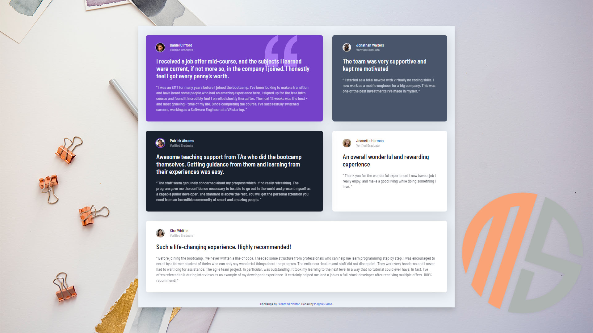

# Frontend Mentor - Testimonials grid section

## Wellcome 👋 
This is my solution to the [Testimonials grid section challenge on Frontend Mentor](https://www.frontendmentor.io/challenges/testimonials-grid-section-Nnw6J7Un7).

### The challenge
The challenge is a layout that shows five cards in specific order.
This challenge should be responsive and as close as possible to the template.

### Screenshot

### Links

