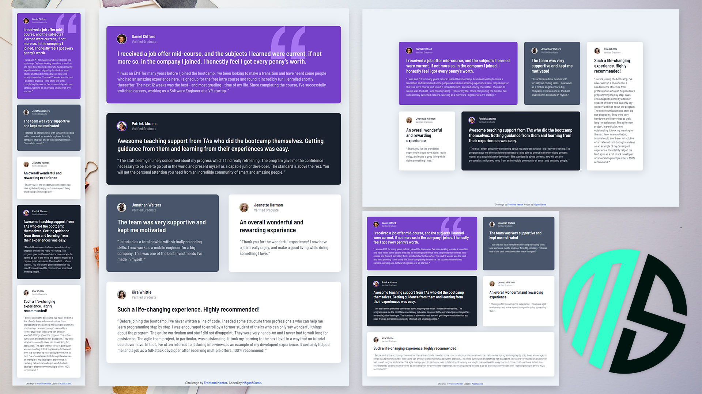

# Frontend Mentor - Testimonials grid section


## Wellcome 👋 
This is my solution to the [Testimonials grid section challenge on Frontend Mentor](https://www.frontendmentor.io/challenges/testimonials-grid-section-Nnw6J7Un7).

### The challenge
The challenge is a layout that shows five cards in specific order.
This challenge should be responsive and as close as possible to the template.

### Screenshot

### Links

- Solution URL: [My Solution Link](https://github.com/M3gan3Sama/testimonials-grid-section-main)
- Live Site URL: [My Live Site](https://m3gan3sama.github.io/testimonials-grid-section-main/)

## My process

### Built with
- HTML5
- CSS
- CSS Grid
- Flexbox
- Media Query

### What I learned

I learned more about CSS Grid in this project.
I used 
```CSS
main {
  grid-template-areas: ;
}
```
and mixed it with some media queries to change my layout based on different screen
devices for better responsive result.

### Continued development
I still have some difficulty to use grid for responsive layouts.

## Author
- Website - [M3gan3Sama](https://github.com/M3gan3Sama)
- Frontend Mentor - [@M3gan3Sama](https://www.frontendmentor.io/profile/M3gan3Sama)